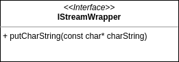

# Introduction

LoggingLib is a module containing classes used to handle various kinds of logged messages. Logging is crucial for proper tracking and debugging of the program execution. Additionally collected logs can be used as the history of run tests, trained models etc.

# Version changes

## 0.0.1

- Introduced macros
    - `LOG_WARN` 
    - `LOG_ERROR` 
    - `LOG_INFO`

## 1.0.0

- Introduced [Logger](#Logger)
- Introduced [Stream Wrappers](#StreamWrappers)
    - [IStreamWrapper](#IStreamWrapper)
    - [BaseStreamWrapper](#BaseStreamWrapper)
    - [DecolorizingStream](#DecolorizingStream)
- Introduced new macros
    - `LOG_RESET_LOGGER`
    - `LOG_SET_DEFAULT_STREAM`
    - `LOG_SET_NAMED_STREAM`

# Components

## Logger

Class responsible for managing logging mechanics. It follows Singleton pattern and its state can be changed by any piece of code, therefore its functionality should be used within the local context and the global modifications should be made at major checkpoints. Despite the class having public interface, it should be used with help of logging lib macros defined in `LoggingLib/LoggingLib.hpp` header file.

Implementation:
```cpp
namespace loggingLib
{
    class Logger;
}
```

Segregation of logged messages is performed with use of channels. Every channel is unique by its name. Logs can be differentiated by `LogType` enum class variants carrying additional semantics:

- **WARN** - used for logs which should be emphasized but don't directly affect the program
- **ERROR** - used for logs that indicate specific types of fault and additionally throw a runtime error instance 
- **INFO** - used for informative logs


```cpp
auto& logger = loggingLib::Logger::getInstance();

logger.logInfoOnChannel("Channel 1", "Some info message.");
logger.logWarnOnChannel("Channel 2", "Some warning.");
logger.logErrorOnChannel("Channel 3", "The program is terminated!");
```

Logger can manage streams associated to channels, thus redirecting the logged messages to appropriate instances of [Stream Wrappers](#Stream-Wrappers). Associating streams to channels can be performed either by assigning `std::ostream` instance or pre-created wrapper.

```cpp
auto& logger = loggingLib::Logger::getInstance();

logger.setNamedChannelStream("Channel 1", std::cerr);
logger.setNamedChannelStream("Channel 2", std::make_shared<loggingLib::BaseStreamWrapper>(std::cout));

logger.setNamedDefaultStream(std::cout);

// Cleans the logger's internal configuration
logger.reset();
```

## Stream Wrappers

Set of classes following the Decorator pattern. Wrappers can perform a certain kind of action defined in concrete class before or after delegating further streaming to the wrapped object. Additionally the streamed content can be modified in a specific way. 

### IStreamWrapper

An interface for [Stream Wrappers](#Stream-Wrappers). Defines a public streaming method being a template-pattern algorithm which uses a couple of functions possible to be overridden. 

Implementation:
```cpp
namespace streamWrappers
{
    class IStreamWrapper;

    using IStreamWrapperPtr = std::shared_ptr<IStreamWrapper>;
}
```




### BaseStreamWrapper

Class implementing [IStreamWrapper](#IStreamWrapper) interface. Does not perform any modifications on the streamed content and serves as the intermediate object between `std::ostream` and other wrappers.

Implementation:
```cpp
namespace streamWrappers
{
    class BaseStreamWrapper : public IStreamWrapper;
}
```

BaseStreamWrapper defines a static factory function creating a stack of std::ostream -> BaseStreamWrapper -> Given type of wrapper.

```cpp
struct CustomWrapper
{
    CustomWrapper(IStreamWrapperPtr internal);
};


streamWrappers::BaseStreamWrapper::spawnWrapped<CustomWrapper>(std::cout);
```

### DecolorizingStream

Class implementing [IStreamWrapper](#IStreamWrapper) interface. Deletes character sequences from streamed content, so that it no longer contains information about the message color.


Implementation:
```cpp
namespace streamWrappers
{
    class DecolorizingStream : public IStreamWrapper;
}
```