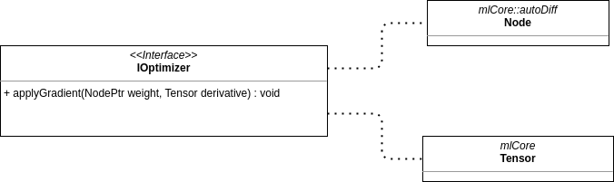

# Introduction

MLCore is a module containing the core components for other data processing / machine learning modules. Defines basic structures for efficient data management and processing, automatic differentiation grounds and interfaces for machine learning models.

# Version changes

## 1.0.0

- Introduced [BasicTensor](#BasicTensor)
- Introduced [TensorIterator](#TensorIterator)
- Introduced [ITensorInitializer](#itensorinitializer) interface
- Added new [TensorInitializers](#TensorInitializers)
    - [RangeTensorInitializer](#RangeTensorInitializer)
    - [GaussianTensorInitializer](#GaussianTensorInitializer)
- Introduced base [GraphNodes](#GraphNodes) interface ([Node](#Node)) 
- Added new [GraphNodes](#GraphNodes)
    - [Variable](#variable)
    - [Constant](#Constant)
    - [Placeholder](#Placeholder)
- Introduced base [UnaryOperators](#UnaryOperators) interface ([UnaryOperator](#UnaryOperator))
- Added new [UnaryOperators](#UnaryOperators)
    - [ReluOperator](#reluoperator)
    - [SigmoidOperator](#SigmoidOperator)
- Introduced base [BinaryOperators](#BinaryOperators) interface ([BinaryOperator](#BinaryOperator))
- Added new [BinaryOperators](#BinaryOperators):
    - [AddOperator](#AddOperator)
    - [SubtractOperator](#SubtractOperator)
    - [DivideOperator](#DivideOperator)
    - [MultiplyOperator](#MultiplyOperator)
    - [MatmulOperator](#MatmulOperator)
    - [PowerOperator](#PowerOperator)
- Introduced [ComputationGraph](#ComputationGraph)
- Introduced [TensorOperations](#TensorOperations)
- Introduced [Models](#Models) interfaces:
    - [ILayer](#ILayer)
    - [Callback](#Callback)
    - [IMeasurable](#IMeasurable)
    - [IMetric](#Imetric)
    - [IOptimizer](#IOptimizer)

# Components

## BasicTensor

Template class responsible for holding and managing underlying generic-type array. Declares methods for getting/setting values and modifying the internal tensor's state (for example tensor's shape). The available underlying types are specified by the explicit class instantiation inside the source code.

```cpp
namespace mlCore
{
    template <typename ValueType>
    class BasicTensor;
}
```

Class enables several ways to create the object other than by copy/move.

```cpp
mlCore::BasicTensor<double> scalarTensor;

mlCore::BasicTensor<double> scalarTensorWithValue = 5.0;

mlCore::BasicTensor<double> shapedTensor({3, 4, 5});

mlCore::BasicTensor<double> shapedTensorWithDefaultValue({3, 4}, 0);

mlCore::BasicTensor<double> shapedTensorWithInitValues({2, 2}, {1, 2, 3, 4});
```

Assigning values for specific parts of the tensor can be performed with use of a couple of methods, one of which uses [TensorInitializers](#TensorInitializers). 

```cpp
// 0 0 0
// 0 0 0
mlCore::BasicTensor<double> tensor(std::vector<size_t>{2, 3}, 0); // default value = 0

// 1 5 1
// 5 1 5
tensor.fill({1, 5}, true); // wrapData = true

std::vector<double> data{7, 8, 9};

// 7 8 9
// 7 8 9
tensor.fill(data.begin(), data.end(), true);

mlCore::RangeTensorInitializer<double> initializer(0); 

// 0 1 2
// 3 4 5
tensor.fill(initializer);

// 0 11 22
// 3 33 44
tensor.assign({{0, 2}, {1, 3}}, {11, 22, 33, 44});
```

BasicTensor can serve as a range via iterators ([TensorIterator](#TensorIterator)). 

```cpp
mlCore::BasicTensor<double> tensor(std::vector<size_t>{2, 3});
tensor.fill({1, 2, 3, 4, 5, 6});


for(auto it = tensor.begin(); it < tensor.end(); it++)
{
    std::cout << *it << ' ';    // output: 1 2 3 4 5 6
}
```

The class provides basic operators like: adding, subtracting, dividing, multiplying, matrix multiplication, negation, transposition.

```cpp
mlCore::BasicTensor<double> tensor({2, 2});

// 1 2 
// 3 4
tensor.fill({1, 2, 3, 4});

// copy assignment
const auto tensor2 = tensor;

std::cout << tensor.matmul(tensor2);
```
```
<BasicTensor dtype=d shape=(2, 2)>
[
 [ 7, 15]
 [10, 22]
]
```

Also available is streaming the tensor:

```cpp
mlCore::BasicTensor<double> tensor(std::vector<size_t>{2, 3});
tensor.fill({1, 2, 3, 4, 5, 6});

std::cout << tensor << std::endl;
```
```
<BasicTensor dtype=d shape=(2, 3)>
[
 [1, 2, 3]
 [4, 5, 6]
]
```

Tensors can be quickly reshaped without any memory reallocation in case the given shape is compatible with the tensor.

```cpp
mlCore::BasicTensor<double> tensor({2, 3, 4}, 5);

tensor.reshape({2, 12});
```

Available variants of `ValueType`:

```cpp
using Tensor = BasicTensor<double>;
using TensorPtr = std::shared_ptr<Tensor>
```

## TensorIterator

Template class implementing basic iterator traits pointing to a specific place in tensor's data. Tensor iterators are compared based on the location of the underlying pointers. Class can be used to iterate through other containers holding contiguous memory.

```cpp
namespace mlCore
{
    template <typename ValueType>
    class TensorIterator;
}
```

```cpp
double data[5] = {1, 2, 3, 4, 5};

mlCore::TensorIterator<double> iter(data);
mlCore::TensorIterator end(data + 5);

while(;iter < end; ++iter)
{
    std::cout << *iter << '\n';
}
```

## TensorInitializers

Classes used to generate values for tensor data initializing purposes. Rules of data generation are specified by the concrete type of the initializer and the internal configuration.

### ITensorInitializer

Template interface for TensorInitializers. Defines methods for data generation and initializer's ability to yield more values.


Implementation:
```cpp
namespace mlCore::tensorInitializers
{
    template <typename ValueType>
    class ITensorInitializer;
}
```

### RangeTensorInitializer

Class implementing [ITensorInitializer](#ITensorInitializer) interface. 

Implementation:
```cpp
namespace mlCore::tensorInitializers
{
    template <class ValueType>
    class RangeTensorInitializer : public ITensorInitializer<ValueType>;
}
```

RangeTensorInitializer generates ordered data based on its parameters and can be used to create linear spaces.

```cpp
constexpr uint64_t kStartValue = 5;
constexpr uint64_t kEndValue = 20;
constexpr uint64_t kStep = 2;

mlCore::tensorInitializers::RangeTensorInitializer<uint64_t> initializer(kStartValue, kStep, kMaxValue);

while(initializer.canYield())
{
    // 5 7 9 11 13 15 17 19
    std::cout << initializer.yield();
}
```

### GaussianTensorInitializer

Class implementing [ITensorInitializer](#ITensorInitializer) interface. 

Implementation:
```cpp
namespace mlCore::tensorInitializers
{
    template <class ValueType>
    class GaussianTensorInitializer : public ITensorInitializer<ValueType>;
}
```

GaussianTensorInitializer samples data from gaussian distribution parametrized by the given mean and standard deviation.

```cpp
constexpr double kMean = 0.0;
constexpr double kStdDev = 1.0;

mlCore::tensorInitializers::GaussianTensorInitializer<uint64_t> initializer(kMean, kStdDev);

while(initializer.canYield())
{
    // 5.0672514740e-1   4.9139724980e-1 4.2433275600e-2 ...
    std::cout << initializer.yield();
}
```

## GraphNodes

Group of classes in form of [BasicTensor](#BasicTensor) wrappers with associated functionality and semantics depending on the concrete subclass. GraphNodes make up a huge part of automatic differentiation functionality. They are used as the components of tree structures used by [ComputationGraph](#ComputationGraph).


### Node

Base class for all GraphNodes. It defines basic methods to manage the wrapped tensor and for identification purposes. 

Implementation:

```cpp
namespace mlCore::autoDiff
{
    class Node;
}
```

Node class operates on a specific type of [BasicTensor](#BasicTensor) with `double` underlying data type.

```cpp
namespace mlCore
{
    using Tensor = BasicTensor<double>;
}

const std::string nodeName = "SampleNode(2, 3)";

// 5 5
// 5 5
mlCore::autoDiff::Node node(mlCore::Tensor({2, 2}, 5), nodeName);

std::cout << node.getIndex() << '\n';
std::cout << node.getName() << '\n';

// setting new value

// 25 25
// 25 25
node.getValue() *= node.getValue();
```

There is defined a typename for Node pointers.

```cpp
using NodePtr = std::shared_ptr<Node>;
```

### Variable

Class derived from [Node](#Node) providing semantics for nodes designed to change hold internal tensor and share it for changes (for example weight matrix for dense layers).

Implementation:

```cpp
namespace mlCore::autoDiff
{
    class Variable : public Node;
}
```

There is defined a typename for Variable pointers.

```cpp
using VariablePtr = std::shared_ptr<Variable>;
```

### Constant

Class derived from [Node](#Node) providing semantics for nodes designed to keep their values unchanged (for example positional encoding in transformer input). 

Implementation:

```cpp
namespace mlCore::autoDiff
{
    class Constant : public Node;
}
```

There is defined a typename for Variable pointers.

```cpp
using ConstantPtr = std::shared_ptr<Constant>;
```

### Placeholder

Class derived from [Node](#Node) providing semantics for nodes designed to dynamically change their underlying tensors (for example as components inside model's input layer). Placeholders play also role in [ComputationGraph](#ComputationGraph) as the targets for feed dictionary used in forward graph traversing.

Implementation:

```cpp
namespace mlCore::autoDiff
{
    class Placeholder : public Node;
}
```

There is defined a typename for Variable pointers.

```cpp
using PlaceholderPtr = std::shared_ptr<Placeholder>;
```

## UnaryOperators

Group of classes forming a branch inside the [GraphNodes](#GraphNodes) hierarchy. UnaryOperators are an important part of the automatic differentiation mechanics. They provide semantics for components performing certain operation on the single input node.

### UnaryOperator

Base class for unary operator nodes, inherits from [Node](#Node). Defines methods for computing output value based on a single input node. 

Implementation:
```cpp
namespace mlCore::autoDiff::unaryOperators
{
    class UnaryOperator : public Node;
}
```

Example:
```cpp
using mlCore::autoDiff::unaryOperators::UnaryOperator;
using mlCore::autoDiff::Node;
using mlCore::Tensor;

class SquareUnaryOp : public UnaryOperator
{
public:

    SquareUnaryOp(mlCore::autoDiff::NodePtr input) : input_(input) {}

    void updateValue() override
    {
        input_->getValue() *= input_.getValue();
    }
};

auto input = std::make_shared<Node>(Tensor({2, 3, 4}, 2));
auto oper = std::shared_ptr<SquareUnaryOp>(input);

oper->updateValue();

std::cout << oper->getInput()->getValue();
```

### ReluOperator

A subclass of [UnaryOperator](#UnaryOperator). Performs REctangular Linear Unit activation operation, clamping the input to <0, inf) range.

### SigmoidOperator

A subclass of [UnaryOperator](#UnaryOperator). Performs sigmoid operation, clamping the input to (0, 1) range.

## BinaryOperators

Group of classes forming a branch inside the [GraphNodes](#GraphNodes) hierarchy. BinaryOperators are an important part of the automatic differentiation mechanics. They provide semantics for components performing certain operation on two input nodes.

### BinaryOperator

Base class for binary operator nodes. Defines method updating internal value based on two input nodes.

Implementation:

```cpp
namespace mlCore::autoDiff::binaryOperators
{
    class BinaryOperator : public Node;
}
```

Example:

```cpp
using mlCore::autoDiff::binaryOperators::BinaryOperator;
using mlCore::Tensor;
using mlCore::autoDiff::NodePtr;

class CustomBinaryOp : public BinaryOperator
{
public:

    CustomBinaryOp(NodePtr lhs, NodePtr rhs) : lhsInput_(lhs), rhsInput_(rhs) {}

    void updateValue() override
    {
        value_ = lhsInput_->getValue() * lhsInput_->getValue() + rhsInput_->getValue();
    }
};


Tensor value({2, 3}, 4);

auto node = std::shared_ptr<mlCore::autoDiff::Node>(value);

CustomBinaryOp op(node, node);

op->updateValue();
std::cout << op->getValue();
```

### AddOperator

A subclass of [BinaryOperator](#BinaryOperator). Performs basic adding operation between input nodes. Wraps [BasicTensor](#BasicTensor)'s `operator+`.

### DivideOperator

A subclass of [BinaryOperator](#BinaryOperator). Performs basic dividing operation between input nodes. Wraps [BasicTensor](#BasicTensor)'s `operator/`.

### MatmulOperator

A subclass of [BinaryOperator](#BinaryOperator). Performs matrix multiplication between input nodes. Wraps [BasicTensor](#BasicTensor)'s `matmul` method.

### MultiplyOperator

A subclass of [BinaryOperator](#BinaryOperator). Performs basic multiplication between input nodes. Wraps [BasicTensor](#BasicTensor)'s `operator*` method.

### PowerOperator

A subclass of [BinaryOperator](#BinaryOperator). Performs basic power operation between input nodes. Wraps [TensorOperations](#TensorOperations)'s `power` function.

### SubtractOperator

A subclass of [BinaryOperator](#BinaryOperator). Performs basic subtraction between input nodes. Wraps [BasicTensor](#BasicTensor)'s `operator-` method.

## GraphOperations

Set of groups of functions performing operations between [GraphNodes](#GraphNodes) instances. GraphOperations define methods creating various types of nodes, connecting them to the inputs. 

### UnaryOperations

Set of functions performing operations on two input nodes. They create proper types of output nodes and add them to ComputationGraph instance if present.

### BinaryOperations

Set of functions performing operations on a single input node. They create proper types of output nodes and add them to ComputationGraph instance if present.

### NodeActivations

Set of activation functions performing certain operations on input node. They create proper types of output nodes and add them to ComputationGraph instance if present.

## ComputationGraph

Class responsible for storing [GraphNodes](#GRaphNodes) instances and performing operations on whole tree structure. It can collect nodes belonging to different trees creating computation forest. ComputationGraph makes for one of the main parts of automatic differentiation tools. 

Basic workflow of the graph can be described as:
1. Graph is activated, allowing to add more nodes.
2. Nodes are added to the graph by the client.
3. Graph is deactivated, disallowing to add anymore nodes.
4. Forward pass is requested:
    - Graph sorts its nodes so that the furthest ones are updated first. 
    - Values of the nodes are updated either via given feed map or, in case of operators, via their internal updating mechanics.
5. Backward pass is requested:
    - Gradients computing starts from the given root node's perspective.
    - Nodes tree is traversed backwards, collected gradients are stored, cumulated gradient is passed to next tree levels.
6. Gradients are collected and used by the client.
7. Gradients are flushed by the client, so that the graph is reset.

Implementation:
``` cpp
namespace mlCore::autoDiff
{
class ComputationGraph;
}
```

Example:
```cpp
using namespace mlCore::autoDiff;
using mlCore::Tensor;

std::set<NodePtr> getTree() { ... }

std::map<PlaceHolderPtr, Tensor> getFeedMap() { ... }

NodePtr getTreeOutput() { ... }

ComputationGraph graph;

graph.activate();

for(const auto& node : getTree())
{
    graph.addNode(node);
}

graph.deactivate();

graph.forwardPass({getFeedMap()});

graph.computeGradients(getTreeOutput());

for(const auto& node : getTree())
{
    const auto nodeId = node.getId();

    if(graph.hasGradient(nodeId))
    {
        std::cout << nodeId <<  " - " << graph.getGradientById(nodeId) << std::endl;
    }
}

graph.clearGradients();

```

## TensorOperations

Set of functions performing either binary or unary operations on [BasicTensor](#BasicTensor) instances. The functions can be used to avoid duplicate tensor-modifying code.

Implementation:
```cpp
namespace mlCore
{
template <typename ValueType>
class BasicTensorOperations;
}
```

Available functions:
- **power(lhs, rhs)** - implements power operation with base values from `lhs` and factors from `rhs`.
- **ln(arg)** - implements natural logarithm.
- **relu(arg)** - implements REctangular Linear Unit activation function.
- **sigmoid(arg)** - implements Sigmoid activation function.

## Models

Set of interfaces for classes being components of more complex architectures. They take part in the workflow of a given model and can help implement specific design patterns making for architecture of the desired structure. Models carry semantics sued in the functioning of a model. 

### Callback

An interface for classes following the Command design pattern. They can hold various parts of a given model and perform certain actions (for example make a backup of the model) based on the internal mode.

Implementation
```cpp
namespace mlCore::models
{
class Callback;

using CallbackPtr = std::shared_ptr<Callback>;
}
```


### ILayer

An interface for classes being parts of the model, covering a certain scope of it. Layers can be defined as specific levels of detailed model's description. Layers can be standalone and flat (for example a standard dense layer) or contain other layers inside (for example an encoder containing several levels of encoding). The second case can follow the Composite design pattern.

Implementation
```cpp
namespace mlCore::models
{
class ILayer;

using ILayerPtr = std::shared_ptr<ILayer>;
}
```


### IMeasurable

An interface for classes following the Observer design pattern, prone to be measured by classes implementing [IMetric](#IMetric) interface. IMeasurable-implementing classes serve play the role of publishers and can be subscribed by number and types of metrics specified by the concrete measurable class. Internal implementation of the class may be connected with the Composite design pattern and thus delegate the metrics update to the contained sub-Measurable objects.

Implementation:
```cpp
namespace mlCore::models
{
class IMeasurable;

using IMeasurablePtr = std::shared_ptr<IMeasurable>;
}
```


### IMetric

An interface for classes following the Observer design pattern, performing a certain type of measuring process. Metrics can create statistical data based on the internal parameters and pointed objects and updates its state by the `notify` method called be the metric's owners.

Metrics can be also notified using **MetricContext** objects holding content specified by the concrete implementation.

Implementation:
```cpp
namespace mlCore::models
{
class MetricContext;

class IMetric;

using IMetricPtr = std::shared_ptr<IMetric>;
using MetricContextPtr = std::shared_ptr<IMetric>;
}
```


### IOptimizer

An interface for classes updating models' weights ([Node](#Node)) with given gradient slices ([Tensor](#Tensor)) according to the internal parameters and the updating politics of a concrete implementation of the interface. 

```cpp
namespace mlCore::models
{
class IOptimizer;

using IOptimizerPtr = std::shared_ptr<IOptimizer>;
}
```

